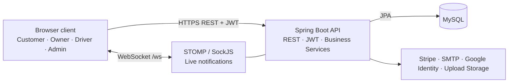

# Wagba — Food Delivery Platform

Wagba is a full-stack food-delivery platform that connects **customers**, **restaurant owners**, **drivers**, and **administrators** in one delivery lifecycle. From discovering a restaurant to payment, preparation, delivery, earnings, and reviews, each user works through a dedicated role-based experience.


[Uploading Screencast from 2026-08-26 21-37-26.webm…]()


> **Want the detailed technical view?** Read the complete [System Design](system-design.md) for requirements, data model, service boundaries, order lifecycle, and API design.

## The idea

Food delivery is more than placing an order: it requires coordinating customers, restaurants, drivers, payments, and support operations in real time. Wagba models that workflow as one platform:

| User | What they can do |
| --- | --- |
| **Customer** | Discover restaurants and menus, manage a cart and addresses, use coupons, pay, follow an order, save favorites, reorder, and leave reviews. |
| **Restaurant owner** | Create and manage a restaurant, menu, categories, availability, incoming orders, preparation status, wallet, and earnings. |
| **Driver** | Create a delivery profile, share location, accept delivery work, update pickup/delivery status, review earnings, and withdraw funds. |
| **Admin** | Approve and moderate users, drivers, and restaurants; manage coupons; and monitor orders, analytics, and driver performance. |

## Key capabilities

- Secure authentication with email verification, password reset, JWT, and Google sign-in.
- Restaurant discovery, food catalogues, cart management, addresses, favorites, coupons, and reviews.
- Card payments through Stripe, plus cash-order support.
- Restaurant order handling and the complete driver delivery workflow.
- Wallet, earnings, and withdrawal flows for restaurant owners and drivers.
- Persisted notifications with live updates through WebSockets.
- Admin moderation, operational statistics, analytics, and coupon management.

## Architecture

Wagba has a static, role-based web frontend and a stateless Spring Boot backend. The frontend communicates with versioned REST endpoints using JWT authentication, while STOMP over SockJS is used for real-time notifications.



The full high-level design, including domain services and the order-state flow, is available in the [System Design](system-design.md#5-high-level-design).

## Technology stack

| Area | Technologies |
| --- | --- |
| **Backend** | Java 21, Spring Boot 4, Spring MVC, Spring Security, Spring Data JPA, Maven |
| **Database** | MySQL 8+; H2 for automated backend tests |
| **Frontend** | HTML, CSS, vanilla JavaScript, Bootstrap 5 |
| **Authentication** | JWT, BCrypt password hashing, email verification, Google ID token verification |
| **Real-time** | Spring WebSocket, STOMP, SockJS |
| **Payments** | Stripe PaymentIntents and Stripe.js |
| **Maps & location** | Leaflet and browser geolocation |
| **Email & uploads** | Spring Mail / SMTP and local file storage |

## Project structure

```text
.
├── README.md                                  # Project overview and setup
├── system-design.md                           # Detailed design and diagrams
├── CONTRIBUTING.md                            # Contribution guide
├── SECURITY.md                                # Vulnerability-reporting policy
├── .github/workflows/backend-ci.yml           # Backend test workflow
├── wagba-food-delivery-system-Frontend/       # Role-based static web application
│   ├── index.html                             # Public entry point and authentication
│   ├── customer.html | owner.html | driver.html | admin.html
│   ├── css/styles.css                         # Shared UI styles
│   └── js/                                    # Shared, customer, owner, driver, admin logic
└── wagba-food-delivery-system-Backend/        # Spring Boot API
    ├── src/main/java/com/wagba/
    │   ├── controller/                        # REST endpoints grouped by domain
    │   ├── service/                           # Business rules and workflows
    │   ├── entity/                            # JPA domain entities and enums
    │   ├── repository/                        # Database access
    │   ├── security/                          # JWT and Google-token security
    │   └── config/                            # Security, CORS, WebSocket configuration
    ├── src/main/resources/                    # Runtime configuration template
    └── src/test/                              # H2-backed automated tests
```
