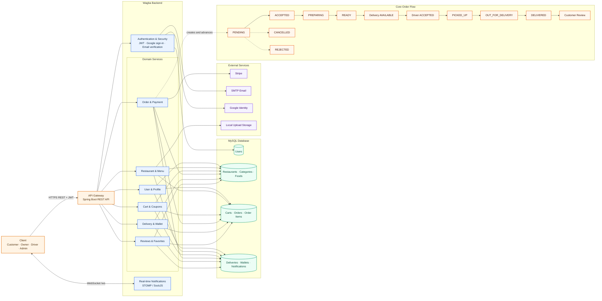
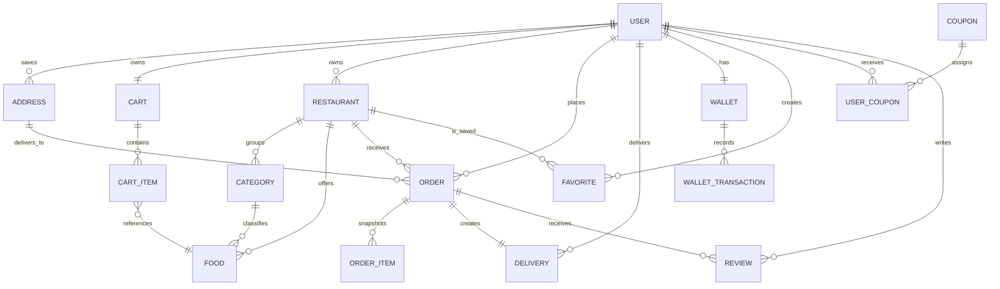

# Wagba System Design

> A living design document for the Wagba food-delivery platform. It combines the original requirements with the capabilities currently implemented in the repository.

## Contents

- [Functional Requirements](#1-functional-requirements)
- [Non-Functional Requirements](#2-non-functional-requirements)
- [API Surface](#3-api-surface)
- [Goals and Users](#4-goals-and-users)
- [High-Level Design](#5-high-level-design)
- [Backend Components](#6-backend-components)
- [Core Data Model](#7-core-data-model)
- [Key Workflows](#8-key-workflows)
- [Real-Time Communication](#9-real-time-communication)

---

## 1. Functional Requirements

### Customer

- Customer should be able to register and login.
- Customer should be able to browse available restaurants.
- Customer should be able to view a restaurant's menu.
- Customer should be able to add food items to a cart.
- Customer should be able to update/remove items from the cart.
- Customer should be able to place an order.
- Customer should be able to provide/select a delivery address.
- Customer should be able to view their orders.
- Customer should be able to track the status of an active order.
- Customer should be able to cancel an order when allowed.
- Customer should be able to rate/review a completed order.

### Restaurant Owner

- Restaurant owner should be able to register.
- Restaurant owner should be able to create a restaurant.
- Restaurant owner should be able to update restaurant information.
- Restaurant owner should be able to manage food categories.
- Restaurant owner should be able to add/update/delete food items.
- Restaurant owner should be able to mark food items as available/unavailable.
- Restaurant owner should be able to view incoming orders.
- Restaurant owner should be able to accept/reject orders.
- Restaurant owner should be able to update the food preparation status.

### Driver

- Driver should be able to register.
- Driver should be able to become available/unavailable for deliveries.
- Driver should be able to view available delivery requests.
- Driver should be able to accept a delivery.
- Driver should be able to view delivery details.
- Driver should be able to mark an order as picked up.
- Driver should be able to mark an order as out for delivery.
- Driver should be able to mark an order as delivered.
- Driver should be able to view delivery history.

### Admin

- Admin should be able to login.
- Admin should be able to view/manage users.
- Admin should be able to activate/deactivate users.
- Admin should be able to review restaurant registration requests.
- Admin should be able to approve/reject restaurants.
- Admin should be able to review driver registration requests.
- Admin should be able to approve/reject drivers.
- Admin should be able to view all orders.
- Admin should be able to monitor the overall system.

---

## 2. Non-Functional Requirements

### 2.1 Performance

- Restaurant listing API should normally respond within 500ms under expected load.
- Menu retrieval should normally respond within 500ms.

### 2.2 Availability

- The system should remain available during normal operating hours.
- A failure in one operation should not corrupt existing orders.

### 2.3 Security

- Passwords must never be stored as plain text.
- Authenticated endpoints must require valid authentication.
- Users must only access resources they are authorized to access.
- Customer should not be able to access restaurant-owner/admin operations.

### 2.4 Data Integrity

- An order must preserve the price of food at the time the order was created.
- An order must not reference unavailable/nonexistent food.
- Order status transitions must follow valid business rules.
- Order creation should be transactional.

### 2.5 Scalability

Architecture must allow us to increase Number of :

- Customers
- Restaurants
- Orders
- Drivers

---

## 3. API Surface

All REST endpoints are rooted at `/api/v1`. This is a grouped reference; controller source is the authoritative contract for request/response fields.

| Area | Base path | Examples |
| --- | --- | --- |
| Auth & profile | `/auth` | register, verify email, login, Google login, logout, password reset, `/me` |
| Restaurants | `/restaurants` | list restaurants, details, food list, categories |
| Customer | `/customers/me`, `/cart`, `/favorites`, `/coupons` | addresses, cart items, favorites, assigned coupons and previews |
| Orders & payments | `/orders`, `/payments` | checkout, cancel, tracking, reorder, Stripe intent/configuration/confirmation |
| Restaurant owner | `/restaurant-owner` | restaurant, foods, categories, orders, status updates, wallet and earnings |
| Driver | `/driver` | profile, location, deliveries, earnings, wallet and withdrawal |
| Admin | `/admin` | moderation, order data, stats/analytics, driver performance, coupon management |
| Supporting services | `/reviews`, `/notifications`, `/files` | reviews, notification read state, uploads |

Public routes include authentication, restaurant browsing, public restaurant/driver reviews, uploads, and WebSocket negotiation. All other routes require a valid JWT; controller-level role checks enforce access to role-specific operations.
### 3.1 Authentication

```http
POST /api/v1/auth/register
POST /api/v1/auth/login
POST /api/v1/auth/logout
```

### 3.2 Restaurants

```http
GET    /api/v1/restaurants
GET    /api/v1/restaurants/{restaurantId}
POST   /api/v1/restaurants
PUT    /api/v1/restaurants/{restaurantId}
DELETE /api/v1/restaurants/{restaurantId}
```

### 3.3 Foods

```http
GET    /api/v1/restaurants/{restaurantId}/foods
POST   /api/v1/foods
GET    /api/v1/foods/{foodId}
PUT    /api/v1/foods/{foodId}
DELETE /api/v1/foods/{foodId}
```

### 3.4 Cart

```http
GET    /api/v1/cart
POST   /api/v1/cart/items
PUT    /api/v1/cart/items/{foodId}
DELETE /api/v1/cart/items/{foodId}
DELETE /api/v1/cart
```

### 3.5 Orders

```http
POST /api/v1/orders
GET  /api/v1/orders
GET  /api/v1/orders/{orderId}
POST /api/v1/orders/{orderId}/cancel
```

### 3.6 Restaurant Owner

```http
GET  /api/v1/restaurant/orders
POST /api/v1/orders/{orderId}/accept
POST /api/v1/orders/{orderId}/reject
POST /api/v1/orders/{orderId}/preparing
POST /api/v1/orders/{orderId}/ready
```

### 3.7 Driver

```http
GET  /api/v1/deliveries/available
POST /api/v1/deliveries/{deliveryId}/accept
POST /api/v1/deliveries/{deliveryId}/pickup
POST /api/v1/deliveries/{deliveryId}/out-for-delivery
POST /api/v1/deliveries/{deliveryId}/complete
```

### 3.8 Admin

```http
GET   /api/v1/admin/users
PATCH /api/v1/admin/users/{userId}/status

GET   /api/v1/admin/restaurants
POST  /api/v1/admin/restaurants/{id}/approve
POST  /api/v1/admin/restaurants/{id}/reject

GET   /api/v1/admin/drivers
POST  /api/v1/admin/drivers/{id}/approve
POST  /api/v1/admin/drivers/{id}/reject

GET   /api/v1/admin/orders
```

---

## 4. Goals and Users

Wagba coordinates a food order from restaurant discovery through payment, preparation, delivery, and feedback. The platform supports four roles:

| Role | Primary capabilities |
| --- | --- |
| Customer | Browse restaurants and menus, maintain a cart and addresses, apply coupons, pay, track orders, favorite restaurants, and review completed orders. |
| Restaurant owner | Create and manage a restaurant, categories and food items; accept or reject orders; update preparation status; view earnings and withdraw funds. |
| Driver | Create a delivery profile, publish location, accept available deliveries, update pickup/delivery status, view earnings, and withdraw funds. |
| Admin | Moderate users, restaurants, and drivers; inspect orders and analytics; manage coupons; and view driver performance. |

## 5. High-Level Design



The frontend is a vanilla HTML/CSS/JavaScript application with pages for each operational role. Requests enter through the REST API, are authenticated with JWT, and are delegated to the relevant domain service. The backend persists data through JPA/MySQL and integrates with Stripe, SMTP, Google Identity, local uploads, and a STOMP/SockJS notification channel.

## 6. Backend Components

| Component | Responsibility |
| --- | --- |
| `controller` | Versioned REST API grouped by authentication, customer, restaurant owner, driver, admin, payments, reviews, coupons, carts, orders, notifications, and files. |
| `service` | Checkout, order transitions, delivery assignment, payment, wallet, review, notification, seed, and identity workflows. |
| `security` | JWT creation/validation, request filtering, token blacklist, authenticated-user helper, and Google token verification. |
| `config` | Stateless security, CORS, WebSocket/STOMP broker, and web configuration. |
| `entity` / `repository` | JPA model and MySQL persistence. |

## 7. Core Data Model



Important domain details:

- An order snapshots item pricing and stores subtotal, discount, delivery fee, total, payment method/reference, and paid state.
- A `Delivery` has one order and is assigned to a driver when accepted. It tracks acceptance, pickup, delivery timestamps, fee, and driver earning.
- Restaurants and drivers pass approval/moderation workflows; user and restaurant status are stored as enums.
- Wallets and wallet transactions support restaurant-owner and driver earnings/withdrawal flows.
- Coupons are global entities and can be assigned to individual users through `UserCoupon`.

## 8. Key Workflows

### Authentication and onboarding

1. A user registers with a pending role.
2. Email verification activates the selected role; Google sign-in is also supported.
3. Login returns a JWT used as `Authorization: Bearer <token>` for protected REST calls.
4. Logout blacklists the token. Password reset and password change flows are available.

### Checkout and payment

1. A customer builds a cart from available food for a restaurant and selects a saved address.
2. Coupon preview calculates the applicable discount.
3. Checkout creates an order from the cart, preserving item prices and delivery fee at that time.
4. Card payments use Stripe PaymentIntents; cash orders are represented in the order payment fields.
5. The restaurant accepts or rejects the order. Accepted orders progress through preparation and create/enable delivery work for drivers.

### Fulfillment and tracking

1. An available driver accepts a delivery.
2. The driver marks it picked up and then delivered.
3. Customers can retrieve order tracking data and receive persisted/live notifications.
4. Once complete, customers can review the restaurant and/or driver; financial records feed relevant wallets.

## 9. Real-Time Communication

The backend exposes a SockJS endpoint at `/ws` and uses a simple STOMP broker.

- Broker destinations: `/topic` and `/queue`
- User destination prefix: `/user`
- Notification delivery: `/user/queue/notifications`
- Authentication: the browser passes its JWT while establishing the WebSocket connection; the inbound interceptor validates it.
